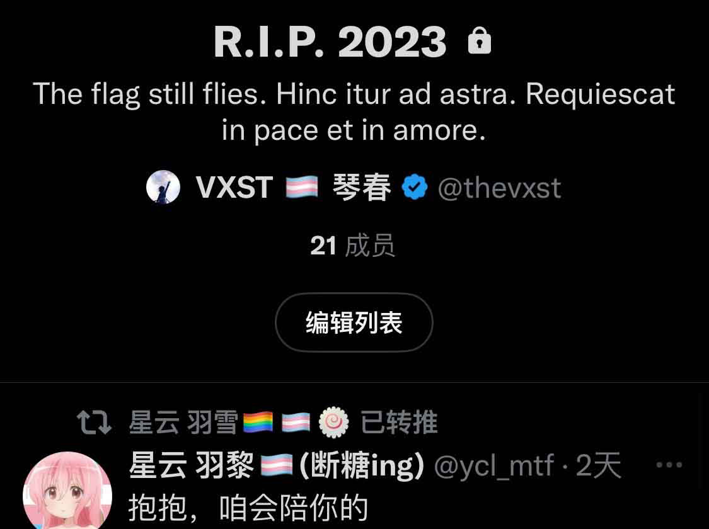

# Help Needed: Transgenders in China Keep Dying

As a transgender woman in China, I am facing a life-threatening situation that is putting my existence and well-being at risk. In December of last year, the Chinese government banned access to hormone replacement therapy (HRT) [1] [2] [10], resulting in the deaths of several dozen trans women[3] [4] [5] [6] [7] [8] [9]. A website [11] has been created to document some of their stories after they passed away.

In just the realm of my knowledge, from January 1st 2023 to now, 58 transgender individuals have lost their lives, averaging out to one person every day. The extent of my knowledge is limited to those who had a Twitter account or were active on QQ. On Twitter, there have been 21 confirmed deaths among transgender individuals, and in my other social circles, mainly on QQ, there have been 37 confirmed deaths. This is an unprecedented and devastating loss of life, and it is heartbreaking to think about the countless others who have suffered and passed away beyond the scope of my knowledge. These individuals were someone's friends, family members, and loved ones, and their loss is a profound tragedy that must not be ignored.

The situation for transgender individuals in China is dire, with ongoing erasure of lives and increasing deaths happening right now. The government's **persecution and discrimination** against this community is unacceptable and must be addressed immediately.

As a member of the transgender community, the dire situation is all too familiar and highlights the urgent need for help and protection. Every day, Chinese transgenders, including myself[12], are facing threats and losing lives. It is imperative that the international community takes action and offers support in our fight for survival. The loss of so many lives is a tragedy that cannot be ignored, and it is imperative that action is taken to support us from this ongoing persecution.

All we ask for is only a chance to live.

Chunqing "Jyn" Shan

2023-02-11

### How you can help

1. Retweet this [twitter](https://twitter.com/thevxst/status/1624329417853124608) linked to the article to spread awareness about current situation faced by the transgender community in China. Your help will be critical.
2. Contact elected representatives or international organizations to raise awareness of this ongoing persecution, every voice counts.

Your support and action can make a significant difference in the lives of transgender individuals in China.

Save lives. Help us.

## Lost Lives: Remembering Those Who Should Still Be Here

### And 54 others.

#### How to contact me

* Email: vxst@riseup.net
* Telegram: https://t.me/thevxst
* Twitter: https://twitter.com/thevxst

#### References

 1. [Central Government Updated Banned Medicine List](https://www.suzhou.gov.cn/szsrmzf/zdlyscgzbz/202212/9721c24858c94231911b31de47f19d4d.shtml)
 2. [New Medicine Ban will take effect in December](https://finance.sina.cn/chanjing/gdxw/2022-11-03/detail-imqmmthc3169517.d.html)
 3. [noah](https://one-among.us/profile/noname3031)
 4. [Chica 陈由岐](https://one-among.us/profile/wangzihao980)
 5. [Anilovr](https://one-among.us/profile/Anilovr)
 6. [蓝狗](https://one-among.us/profile/dogesir_)
 7. [浅羽猫头](https://one-among.us/profile/homoyamakaze)
 8. [星云 羽雪](https://twitter.com/akasa_musha)
 9. [Comments on deaths](https://twitter.com/torontobigface/status/1623969832810201088)
 10. [Central Government's Decision about Trans](https://twitter.com/Homura_Alter/status/1612584118658768896)
 11. [One among us](https://one-among.us/)
 12. [My Infomation](https://twitter.com/thevxst/status/1463063120734154758)

---

## Hi, I'm Jyn Spring (Chunqing Shan) 👋

> Stay fortitude, Do good, Be excellence

#### Skills 🔧

* Advanced algorithm and mathematics
([Rk.27 in National Olympiad in Informatics 2012](https://bytew.net/OIer/?query=UID4470);
ProjEuler L3(only for fun, user is vxst); Some research on group theory)
* CI/CD pipelines using CircleCI, GitHub Action and Jenkins; DevOps with
production HA kubernetes cluster manage experience on EKS
* Backend development: Python/Django, Node.js
* Pattern recognition, machine learning and deep learning, using sklearn and TF
* High-performance computing, MPI and OpenMP, hotspots optimization, was the
Supercomputing Cluster Manager in ZJU.

#### Sites running by me

* OIWiki Sites([oiwiki.com](https://oiwiki.com) /
  [oiwiki.org](https://oiwiki.org) / [oiwiki.net](https://oiwiki.net))
  , continuous deployment to my personal kubernetes and S3 and cloudflare
  daily.
* [MtF Hub](https://hub.mtf.party): A Mastodon instance for male-to-female transgender
* [MtF Party!](https://mtf.party): A site contains guides on how to live/hide and
get medical support as a MtF transgender

#### Contact me

* Email: vxst@riseup.net
* Telegram: https://t.me/thevxst
* Twitter: https://twitter.com/thevxst

> The only sure way to contact me is by email.
>
> If you want high E2E security, use GPG, It's pretty hard to get a key from
> pin-verified, self-destructible and tamper-detactable hardware.
>
> If you want to use S/MIME, you can use the key specified above.
>
> You can assume that even in extreme environment, anything signed using
> F085D7C448667DEF is signed by me personally. The private key only stored
> in tamper-proof, self-destructible hardwares. It's pretty impossible that
> anyone can get the private key. I will honor anything signed by this key
> unless it's revoked by a revoke certificate.
>
> I will read all the emails send to me@vx.st and vxst@riseup.net at
> least once a week. If you (using gmail, outlook and zju mail) can't
> contact me with GPG encrypted email that send to both addresses in 28 days,
> or the reply email is not signed by the F085D7C448667DEF key, you can assume
> I have been dead.

#### Situation Check

* You can send me a GPG signed and encrypted email. I will reply within 7 days
  to confirm my status.
* You can watch the [Canary](canary.md), which will stop update when I'm dead.

### 这里是琴春哦👋

> 永远坚强，永远善良，永远卓越

* I am no man/我不是男人/请使用“她”作为我的代词/我很在意
* 喜欢画画和编曲，但不擅长画画和编曲
* 被赶出家门/流浪中/没有家人了
* 这个世界之后一定会好的吧.......一定会的！

要相信哦，每一处绝望，都会随时间消失，就像去年的落叶一样，不见了踪影。而希望，是今晨的太阳，美丽，晴朗，而且永远存在。
永远温柔，永远心怀希望，当我们的希望汇聚之时，一切都将实现。
一切都会好的，要相信。
我打开屋檐，看到的是蓝天。🏳️‍⚧️

#### 我管理的一些站点

* [MtF指南针](https://mtf.party) / [MtF Hub](https://hub.mtf.party) /
  [MtF RIP](https://mtf.rip) / [OI Wiki镜像站](https://oiwiki.com) /
  [主页](https://vx.st) / [博客](https://blog.vx.st)

#### 我的联系方式：📧

* Email：me@vx.st / vxst@riseup.net, Telegram：[@thevxst](https://t.me/thevxst), Mastodon：[@vxst@hub.mtf.party](https://hub.mtf.party/@vxst)
* GPG: [F085D7C448667DEF](https://raw.githubusercontent.com/vxst/vxst/main/48667DEF.asc)
  * Fingerprint: F2A1 B804 3905 5888 0DFE  BBA0 F085 D7C4 4866 7DEF
  * 下文所述的F085D7C448667DEF，均指代指纹为上述指纹的GPG密钥
* S/MIME:
  * 请先下载并确认信任[MtF Accepted Root CA](https://raw.githubusercontent.com/vxst/vxst/main/MtF_AC_ROOT.crt)
    * 其SHA1指纹为9F36 DB13 315E F5A1 A92C D75E 20F5 C049 522E 7F26，同时它也经过上述GPG密钥的签名。
  * 然后下载并导入SMIME中间证书[MtF Accepted SMIME EV2](https://raw.githubusercontent.com/vxst/vxst/main/MtF_AC_EV2.crt)
  * 然后下载并导入我的邮件证书
    [me@vx.st](https://raw.githubusercontent.com/vxst/vxst/main/me_vxst.crt) /
    [vxst@riseup.net](https://raw.githubusercontent.com/vxst/vxst/main/vxst_riseup.crt)
  * 对于iOS，需要通过打开邮件附件的方式安装证书。

> 联系我最可靠的方式是邮件，没有之一。
>
> 我会保证至少每7天阅读一次邮件，包括使用S/MIME和GPG加密的邮件；对于GPG加密的邮件，由于私钥只存在于不可仿造，多重备份并且可以自毁的硬件中，可以确定只会由我读到。对于S/MIME，几乎只会由我读到，除非发生了严重的意外事件。
>
> 如果有条件，建议使用GPG发送邮件，并且使用以上链接提供的公钥。如果我在28天内没有回复GPG加密的消息，或者回复的消息没有有效的签名，你可以认为我已离世或遭受严重意外。对GPG加密的消息，我必然会在回复时使用F085D7C448667DEF签名。如果收到了回复的消息，但没有使用F085D7C448667DEF签名，很有可能不是我本人发送的邮件。注意我不会接收由国内邮件提供方发送的邮件，例如QQ邮箱，网易邮箱和新浪邮箱等，由于我公开邮件地址并且会阅读每一封邮件，如果允许这些提供商发送的邮件进入收件箱，收件箱会被广告堆满，因此不得不进行高度严格的垃圾邮件过滤。
>
> 我会百分百地收到所有以“@gmail.com”，“@outlook.com”或“@zju.edu.cn”结尾的邮件，并且会完整阅读。
>
> 对于GPG，可以视为经过F085D7C448667DEF签署的一切内容都是我本人的内容。除非已经公开使用销毁证书销毁了这个key，我会对经过F085D7C448667DEF签署的所有内容负责。

#### 对生存状态的确认

* 您可以给我发送经过GPG签名和加密的电子邮件，我一般会在7天内回复以确认我的状态。
* 您可以查看[Canary](canary.md)，当我死后它会停止更新。

> Everything that has a beginning has an end.
