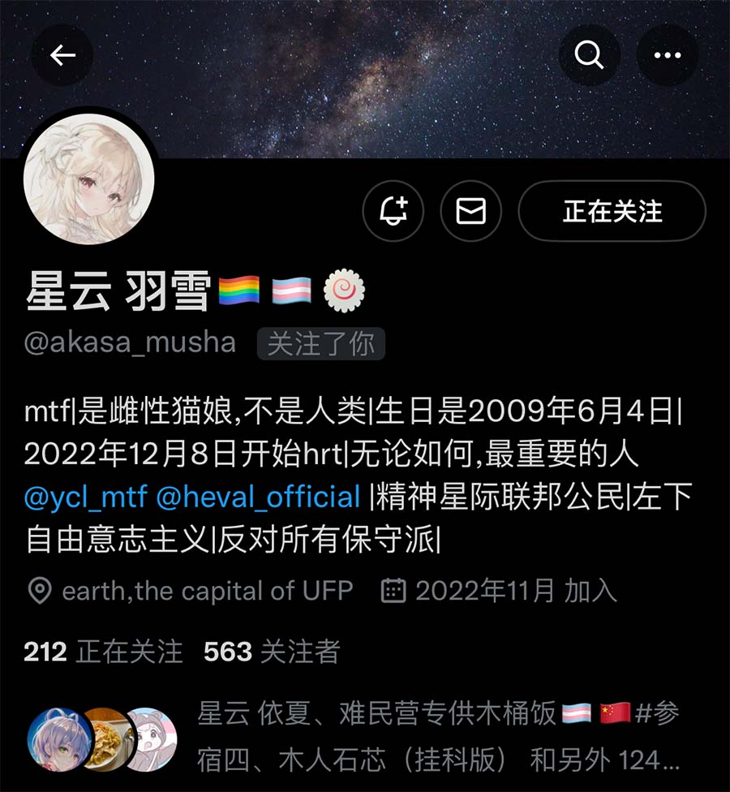

# Chinese Government Is Forcing Transgender To Die

In China, transgender faces a life-threatening situation.

* In September 2022, Chinese Central Government launched a "Clean Source" hundred-day special operation to **destroy illegal transgenders**. [1] [2]
* In December 2022, the Chinese government banned hormone replacement therapy (HRT) by banning HRT-related medicines at sale points and forbidding the transgendering practice in education organizations, such as high schools and universities. [6] [7]
* In January 2023, the government of Guang Dong Province **Brought Illegal Transgenders To Justice**. [3]
* To celebrating the 100th anniversary of the Chinese Communist Party, **Illegal Transgenders Are Sentenced With Drug Trafficking Criminals**. [4]
* The Supreme People's Procuratorate of China is supervising the crime cases of **being illegal transgenders**.  [15]
* The producer of HRT medicines said they might stop producing hormone products. [16]

Those policies have **resulted in the deaths of several dozen transgender** already. [8] [9] [10] [11] [12] [13] [14]

From January 1, 2023 to the February 11th, 2023, there are at least **58 transgenders lost their lives**(update on 2023-02-17, there are 3 more transgender lost their lives), averaging out to one person every day. There is already transgender that is forced to be a refugee[17]. My knowledge is limited to those who had a Twitter account or were active on QQ. On Twitter, there have been 21 confirmed deaths among transgender individuals, and in my other social circles, mainly on QQ, there have been 37 confirmed deaths. This is an unprecedented and devastating loss of life, and it is heartbreaking to think about the countless others who have suffered and passed away beyond the scope of my knowledge. These individuals were someone's friends, family members, and loved ones, and their loss is a profound tragedy that must not be ignored.

The situation for transgender individuals in China is dire, with ongoing erasure of lives and increasing deaths **happening right now**. The government's **persecution and discrimination** against transgender is unacceptable and must be addressed immediately.

As a member of the transgender community, I am all too familiar with the dire situation, which highlights the urgent need for help and protection. Every day, Chinese transgenders, including myself, are facing threats and losing lives. It is imperative that the international community takes action and offers support in our fight for survival. The loss of so many lives is a tragedy that cannot be ignored, and it is imperative that action is taken to support us from this ongoing persecution.

All we ask for is a chance to live.

Chunqing "Jyn" Shan

2023-02-11

Updated on 2023-02-17

### UPDATES:

2023-02-17: 3 more confirmed deaths, the total number of confirmed deaths is 61.

## Government's Official Actions

### Chi Feng City Launched A Special Operation To Destroy Illegal Transgenders

We carried out a "Clean Source" hundred-day special operation to crack down on illegal activities involving prostitution and gambling, and launched a special operation to destroy illegal transgenders.

From Chi Feng City's official Weixing Public Account:

**Ref. 1:**

https://mp.weixin.qq.com/s?__biz=MzA5ODYzMTI1NQ==&mid=2650367212&idx=8&sn=ca5748a8e12bf85474a7e105e255f42d&chksm=88836fd4bff4e6c2132405ca24caad73f4bdf3b21c09efb1a126267b0c3098ac0c33997f5d66&scene=27

https://archive.ph/1e2Fm

**This is a NATIONAL OPERATION, not just a local one.**

### Alukeerqin City Launched A Special Operation To Destroy Illegal Transgenders

We carried out a "Clean Source" hundred-day special operation to crack down on illegal activities involving prostitution and gambling, and launched a special operation to destroy illegal transgenders.

From Alukeerqin City's official Weixing Public Account:

**Ref. 2:**

https://mp.weixin.qq.com/s?__biz=MzA5MDgxMTcyMQ==&mid=2652540523&idx=2&sn=d0e61e7d5374368a03bf98e95e7f839f&chksm=8bebd24dbc9c5b5be0686c4efce3bd635351eeb4fda3741e6e300f7980aa43b4ab264f008995&scene=27

https://archive.ph/50rK8

**This is a NATIONAL OPERATION, not just a local one.**

### **Illegal Transgenders** Were Brought To Justice

The provincial authority organized the investigation and handling of major cases such as the "Shenzhen Illegal Transgenders Case", the "Li Xuliang Illegal Business Case", and the "Li Jianhong Unlicensed Business Case", and the criminals were brought to justice.

From the Guang Dong Province's official report:

**Ref. 3:**

http://mpa.gd.gov.cn/zwgk/ghjh/ndgzjh/content/post_2167399.html

https://web.archive.org/web/20230216093502/http%3A%2F%2Fmpa.gd.gov.cn%2Fzwgk%2Fghjh%2Fndgzjh%2Fcontent%2Fpost_2167399.html

### **Illegal Transgenders** Are Sentenced With Drug Trafficking Criminals

8、We have carried out in-depth actions to destroy drugs and prohibit gambling. We have launched a 100-day campaign to crack down on illegal activities, and special operations to rectify underground mobile gambling venues and the illegal transgender group, among other criminal activities. Throughout the city, we handled 20 cases of illegal transgender, and drug trafficking and sentenced the criminals. We also handled 208 cases of gambling.

From "Celebrating the 100th anniversary of the Chinese Communist Party" news report in Sina, one of the largest news sites in China.

**Ref. 4:**

http://k.sina.com.cn/article_7517400647_1c0126e470590150pc.html

https://web.archive.org/web/20230216091224/http%3A%2F%2Fk.sina.com.cn%2Farticle_7517400647_1c0126e470590150pc.html#/

### Negative Online Phenomena Such As Transgender and LGBT

During the activity, various schools focused on the theme of "Clear and Pure Internet in Yan Zhao" and fully utilized various promotional media such as bulletin boards, bulletin columns, public accounts, LED screens, banners, and short videos to publicize the harm of negative online phenomena such as transgender and LGBT to students.

**Ref. 5:**

Wangdu City's official report:

https://www.wangdu.gov.cn/col/1618902456638/2022/06/09/1654737864912.html

https://web.archive.org/web/20230216110422/https%3A%2F%2Fwww.wangdu.gov.cn%2Fcol%2F1618902456638%2F2022%2F06%2F09%2F1654737864912.html

### Fujian Province Successfully Destroyed LGBT related Publications

We focused on cracking down on harmful audio and video materials that contain sexual implications, soft pornography, bullying and violence, and we destroyed illegal publications on "Bible", LGBT (sexual minority groups), pirated children's picture books, and teaching materials for primary and secondary schools. We also strengthened content supervision and review of anime, online dramas, and variety shows involving minors, in order to build a safe and healthy cultural environment for young people.

From Fujian Province's official report:

http://www.fjxuanchuan.cn/ztzl/dhsf/bstj/202205/t20220507_6254.htm

https://web.archive.org/web/20221225154501/http:/www.fjxuanchuan.cn/ztzl/dhsf/bstj/202205/t20220507_6254.htm

## References

Ref. 6. [Central Government Updated Banned Medicine List](https://www.suzhou.gov.cn/szsrmzf/zdlyscgzbz/202212/9721c24858c94231911b31de47f19d4d.shtml) Archive: https://archive.ph/CmRgQ

Ref. 7. [New Medicine Ban will take effect in December](https://finance.sina.cn/chanjing/gdxw/2022-11-03/detail-imqmmthc3169517.d.html) Archive: https://archive.ph/2royb

Ref. 8: [noah](https://one-among.us/profile/noname3031)

Ref. 9: [Chica 陈由岐](https://one-among.us/profile/wangzihao980)

Ref. 10: [Anilovr](https://one-among.us/profile/Anilovr)

Ref. 11: [蓝狗](https://one-among.us/profile/dogesir_)

Ref. 12: [浅羽猫头](https://one-among.us/profile/homoyamakaze)

Ref. 13: [星云 羽雪](https://twitter.com/akasa_musha)

Ref. 14: [Comments on deaths](https://twitter.com/torontobigface/status/1623969832810201088)

Ref. 15: [Central Government's Decision about Trans](https://twitter.com/Homura_Alter/status/1612584118658768896)

Ref. 16: [Wuhan Jiulong Renfu Medicine Co., Ltd.](./policy/p1.jpg)

Ref. 17: [刘以翎 | 赌上生命的踽踽万里 并非孤立无援](https://yibaochina.com/?p=249487)

## How you can help

* Contact your elected representatives or international organizations to raise awareness of this ongoing persecution, every voice counts.
* Contact journalist you know to raise awareness of this ongoing persecution, every voice counts.
* Retweet this [twitter](https://twitter.com/thevxst/status/1626568169824591872) linked to the article.

Your support and action can make a significant difference in the lives of transgender individuals in China.

Save us, PLEASE. We just want to live.

## How to contact me

* Email: vxst@riseup.net
* Telegram: https://t.me/thevxst

## Lost Lives: Remembering Those Who Should Still Be Here

### And 57 others.

![Twitter](people/rip.jpg